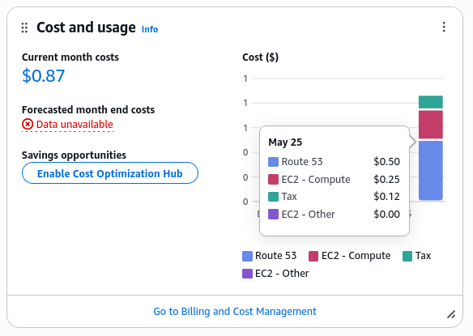

# Todo Microservices Infrastructure Deployment

This project provides an automated infrastructure setup for deploying a containerized microservices Todo application on AWS using Terraform for infrastructure provisioning and Ansible for configuration management.

## Prerequisites

**Important:** Before you begin, please fork this repository to your own GitHub account. This will allow you to make changes and customize the project to your needs.

Before you begin, ensure you have the following:

### 1. Domain Name
You need a registered domain name. Here are some options:
- Purchase an affordable domain from [HostAfrica](https://www.hostafrica.ke/) - `.buzz` domains cost around 165 KSH
- Students: Get a free `.tech` domain for 1 year through [GitHub Student Pack](https://education.github.com/pack)

### 2. AWS Account
- Sign up for an [AWS account](https://aws.amazon.com/) (12-month free tier available for new accounts)
- Familiarize yourself with [AWS free tier limits](https://aws.amazon.com/free/) to avoid unexpected charges

### 3. AWS Access
- Create an IAM user with programmatic access
- Generate and save the access key and secret key
- Follow AWS's [security best practices](https://docs.aws.amazon.com/IAM/latest/UserGuide/best-practices.html)

### 4. SSH Key Pair
Generate an SSH key pair on your local machine:
```bash
ssh-keygen -t rsa -b 2048 -f ~/.ssh/terraform-demo
```

### 5. AMI ID
- Determine the appropriate AMI ID for your chosen region
- Find Ubuntu AMIs at [Ubuntu EC2 AMI Locator](https://cloud-images.ubuntu.com/locator/ec2/)
- Default project region is us-west-2 (Oregon) with AMI: ami-0819a13b911cc3dd0 (Ubuntu 22.04 LTS)

### 6. DNS Management
- By default, this project uses AWS Route 53 for DNS management
- Alternative: You can use [Cloudflare](https://www.cloudflare.com/) for DNS management (requires manual configuration)

### 7. Required Software
- [Terraform](https://developer.hashicorp.com/terraform/tutorials/aws-get-started/install-cli) (v1.0.0+)
- [Ansible](https://docs.ansible.com/ansible/latest/installation_guide/intro_installation.html) (v2.9+)
- [AWS CLI](https://aws.amazon.com/cli/) configured with your credentials

## Project Structure

```
terraform-devops-stage-4a/
│
├── terraform/
│   ├── main.tf              # Main Terraform configuration
│   ├── variables.tf         # Variable definitions
│   ├── terraform.tfvars     # Variable values (create from terraform.tfvars.example)
│   ├── terraform.tfvars.example  # Example variables file
│   └── .gitignore           # Ignores terraform state files, etc.
│
├── ansible/
│   ├── inventory.ini        # Will be generated by Terraform
│   ├── inventory.example    # Example inventory file
│   ├── playbook.yml         # Main Ansible playbook
│   ├── vars.yml             # Variables for Ansible (create from vars.example.yml)
│   ├── vars.example.yml     # Example variables file
│   └── .gitignore           # Ignores sensitive files
│
└── README.md                # Project documentation
```

## Setup and Deployment

### Step 1: Configure Terraform Variables
1. Navigate to the terraform directory:
   ```bash
   cd terraform-devops-stage-4a/terraform
   ```

2. Create your terraform.tfvars file from the example:
   ```bash
   cp terraform.tfvars.example terraform.tfvars
   ```

3. Edit terraform.tfvars with your actual values:
   ```
   aws_region          = "us-west-2"           # Your preferred AWS region
   aws_credentials_file = "~/.aws/credentials"  # Path to your AWS credentials file
   aws_profile          = "default"            # AWS profile to use
   vpc_cidr             = "10.0.0.0/16"        # VPC CIDR block
   public_subnet_cidr   = "10.0.1.0/24"        # Public subnet CIDR
   instance_type        = "t2.micro"           # EC2 instance type (t2.medium recommended)
   ami_id               = "ami-0819a13b911cc3dd0" # AMI ID for your region
   public_key           = "~/.ssh/terraform-demo.pub" # Path to your public SSH key
   private_key_path     = "~/.ssh/terraform-demo"     # Path to your private SSH key
   hosted_zone_id       = "Z0123456789ABCDEFGHIJ"     # Your Route 53 hosted zone ID
   domain_name          = "yourdomain.com"            # Your domain name
   ```

### Step 2: Configure Ansible Variables
1. Navigate to the ansible directory:
   ```bash
   cd ../ansible
   ```

2. Create your vars.yml file from the example:
   ```bash
   cp vars.example.yml vars.yml
   ```

3. Edit vars.yml with your values:
   ```yaml
   # Repository Information
   repo_url: https://github.com/JaMuad/todo-micro-traefik.git

   # Environment Variables
   app_env:
     # Frontend
     PORT: "8080"
     AUTH_API_ADDRESS: "http://auth-api:8081"
     TODOS_API_ADDRESS: "http://todos-api:8082"

     # Auth API
     AUTH_API_PORT: "8081"
     JWT_SECRET: "your_secure_secret"  # Change this!
     USERS_API_ADDRESS: "http://users-api:8083"

     # Todos API
     REDIS_HOST: "redis-queue"
     REDIS_PORT: "6379"
     REDIS_CHANNEL: "log_channel"

     # Users API
     SERVER_PORT: "8083"

     # Domain Name and Email
     DOMAIN_NAME: "yourdomain.com"  # Same as in terraform.tfvars
     EMAIL: "your-email@example.com"

     # Login Details
     USERNAME: "admin"
     PASSWORD: "your_secure_password"  # Change this!
   ```

### Step 3: Deploy Infrastructure
1. Return to the terraform directory:
   ```bash
   cd ../terraform
   ```

2. Initialize Terraform:
   ```bash
   terraform init
   ```

3. Plan the deployment:
   ```bash
   terraform plan
   ```

4. Apply the configuration:
   ```bash
   terraform apply
   ```

5. Confirm by typing `yes` when prompted

The deployment process:
1. Creates AWS infrastructure (VPC, subnet, security groups, EC2 instance)
2. Generates Ansible inventory file
3. Runs Ansible playbook to configure the server
4. Deploys the application using Docker Compose with Traefik

### Step 4: Access Your Application
Once deployment is complete, your application will be available at:
```
https://yourdomain.com
```

## Application Details
The deployed application is a microservices-based Todo application with:
- Frontend UI
- Authentication API
- Todos API
- Users API
- Redis for message queuing
- Traefik for reverse proxy and SSL/TLS

Application source: [https://github.com/JaMuad/todo-micro-traefik.git](https://github.com/JaMuad/todo-micro-traefik.git)

## Cost Optimization and Alternatives

This section provides tips on managing costs associated with this project and suggests free or lower-cost alternatives for some services.

### Understanding AWS Costs

Running this demo on AWS can incur costs. Here's an example of costs that I incurred during my demo session:



### Tips for Keeping Your Costs at $0 (or very low) - What I Recommend:

1.  **Use AWS Free Tier Services:**
    *   **EC2 Instance:** Opt for `t2.micro` instances. While deployment might take longer (approximately 3x compared to `t3.xlarge`), `t2.micro` is eligible for the AWS Free Tier (subject to free tier limits). The demo was run on `t3.xlarge` for speed, but `t2.micro` is sufficient for testing.
    *   Familiarize yourself with the [AWS Free Tier limits](https://aws.amazon.com/free/) to avoid unexpected charges.

2.  **Domain Name:**
    *   **GitHub Student Developer Pack:** If you are a student, sign up for the [GitHub Student Developer Pack](https://education.github.com/pack) to get a free `.tech` domain for 1 year, among other benefits.
    *   Alternatively, look for promotions on domain registrars like [HostAfrica](https://www.hostafrica.ke/) for affordable options.

3.  **DNS Management - Cloudflare Alternative:**
    *   Instead of AWS Route 53, you can use [Cloudflare](https://www.cloudflare.com/) for DNS management. Cloudflare offers free tier that is often enough for personal projects.
    *   **Note:** To use Cloudflare, you will need to:
        *   Manually configure your domain's NS records to point to Cloudflare.
        *   Adjust the Terraform configuration to remove Route 53 resources and potentially use a Cloudflare provider or manage DNS records manually outside of Terraform. This project currently uses Route 53 by default.

4.  **Prompt Cleanup:**
    *   Always run `terraform destroy` (as outlined in the Cleanup section) as soon as you are done with the demo to remove all AWS resources and stop incurring charges.

5.  **Monitor Your Billing:**
    *   Regularly check your AWS Billing Dashboard to monitor any accrued costs. Set up billing alerts to get notified if your spending exceeds a certain threshold.

By following these tips, you can significantly reduce or even eliminate costs while experimenting with this project.

## Cleanup
To destroy all created resources:

```bash
cd terraform-ansible/terraform
terraform destroy
```

Confirm by typing `yes` when prompted.

## Troubleshooting

### Connection Issues
- Ensure your SSH key permissions are correct: `chmod 600 ~/.ssh/terraform-demo`
- Verify security group allows traffic on ports 22, 80, 443, and 8080-8090
- Wait a few minutes for DNS propagation after deployment

### Route 53 Permission Errors
If you encounter permissions errors with Route 53:
1. Ensure your IAM user has Route 53 permissions
2. Verify the hosted zone ID is correct
3. Alternatively, use Cloudflare for DNS management

### Docker Issues
If the application doesn't start properly:
1. SSH into your instance: `ssh -i ~/.ssh/terraform-demo ubuntu@your-instance-ip`
2. Check Docker logs: `docker-compose logs -f`
3. Verify all services are running: `docker-compose ps`

## Contributions
Contributions are welcome! Please feel free to submit a Pull Request.

## License
This project is licensed under the MIT License - see the [LICENSE](LICENSE) file for details.
